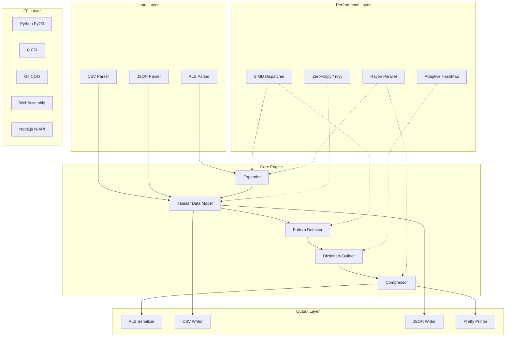

# ALS Compression Library Design Document

## Overview

The ALS (Adaptive Logic Stream) compression library is a high-performance Rust library for compressing structured data (CSV, JSON) using algorithmic pattern description rather than raw enumeration. The library achieves superior compression ratios by detecting patterns (ranges, repetitions, alternations) and encoding them as compact operators.

The architecture prioritizes:
- **Correctness**: Round-trip guarantees via property-based testing
- **Performance**: SIMD acceleration, parallel processing, zero-copy operations
- **Interoperability**: Bindings for Python, Go, C, WASM, Node.js
- **Flexibility**: CTX fallback, configurable thresholds, streaming support
- **Cross-Platform**: Full support for macOS, Windows, and Linux with identical behavior

## Architecture



## Components and Interfaces

### 1. Core Data Structures

```rust
/// Represents a single ALS compression operator
#[derive(Debug, Clone, PartialEq, rkyv::Archive, rkyv::Serialize, rkyv::Deserialize)]
pub enum AlsOperator {
    /// Raw value: "hello"
    Raw(String),
    /// Range: start>end or start>end:step
    Range { start: i64, end: i64, step: i64 },
    /// Multiplier: val*n
    Multiply { value: Box<AlsOperator>, count: usize },
    /// Toggle/Alternator: val1~val2*n
    Toggle { values: Vec<String>, count: usize },
    /// Dictionary reference: _i
    DictRef(usize),
}

/// A single column's compressed representation
#[derive(Debug, Clone)]
pub struct ColumnStream {
    pub operators: Vec<AlsOperator>,
}

/// Complete ALS document
#[derive(Debug, Clone)]
pub struct AlsDocument {
    pub version: u8,
    pub dictionaries: HashMap<String, Vec<String>>,
    pub schema: Vec<String>,
    pub streams: Vec<ColumnStream>,
    pub format_indicator: FormatIndicator,
}

#[derive(Debug, Clone, Copy)]
pub enum FormatIndicator {
    Als,
    Ctx,
}
```

### 2. Pattern Detection Engine

```rust
pub trait PatternDetector: Send + Sync {
    /// Analyze values and return the best compression operator
    fn detect(&self, values: &[&str]) -> DetectionResult;
}

pub struct DetectionResult {
    pub operator: AlsOperator,
    pub compression_ratio: f64,
    pub pattern_type: PatternType,
}

#[derive(Debug, Clone, Copy)]
pub enum PatternType {
    Sequential,      // 1>5
    Arithmetic,      // 10>50:10
    Repeat,          // val*n
    Toggle,          // T~F*n
    RepeatedRange,   // 1>3*2
    Raw,             // fallback
}
```

### 3. Adaptive HashMap

```rust
pub enum AdaptiveMap<K, V> {
    Small(HashMap<K, V>),
    Large(DashMap<K, V>),
}

impl<K: Hash + Eq, V> AdaptiveMap<K, V> {
    pub fn with_capacity_threshold(capacity: usize, threshold: usize) -> Self {
        if capacity < threshold {
            Self::Small(HashMap::with_capacity(capacity))
        } else {
            Self::Large(DashMap::with_capacity(capacity))
        }
    }
}
```

### 4. SIMD Dispatcher

```rust
pub struct SimdDispatcher {
    features: CpuFeatures,
}

#[derive(Debug, Clone, Copy)]
pub struct CpuFeatures {
    pub avx512: bool,
    pub avx2: bool,
    pub neon: bool,
}

impl SimdDispatcher {
    /// Runtime CPU feature detection
    pub fn detect() -> Self;
    
    /// Expand range using best available SIMD
    pub fn expand_range(&self, start: i64, end: i64, step: i64) -> Vec<i64>;
    
    /// Find patterns using SIMD comparison
    pub fn find_runs(&self, values: &[i64]) -> Vec<(usize, usize)>;
}
```

### 5. Public API

```rust
/// Main entry point for compression
pub struct AlsCompressor {
    config: CompressorConfig,
    simd: SimdDispatcher,
}

impl AlsCompressor {
    pub fn new() -> Self;
    pub fn with_config(config: CompressorConfig) -> Self;
    
    /// Compress CSV to ALS
    pub fn compress_csv(&self, input: &str) -> Result<String, AlsError>;
    
    /// Compress JSON to ALS
    pub fn compress_json(&self, input: &str) -> Result<String, AlsError>;
    
    /// Compress tabular data to ALS
    pub fn compress(&self, data: &TabularData) -> Result<AlsDocument, AlsError>;
    
    /// Async versions for large datasets
    pub async fn compress_csv_async(&self, input: &str) -> Result<String, AlsError>;
}

/// Main entry point for decompression
pub struct AlsParser {
    config: ParserConfig,
    simd: SimdDispatcher,
}

impl AlsParser {
    pub fn new() -> Self;
    
    /// Parse ALS to tabular data
    pub fn parse(&self, input: &str) -> Result<TabularData, AlsError>;
    
    /// Parse ALS directly to CSV
    pub fn to_csv(&self, input: &str) -> Result<String, AlsError>;
    
    /// Parse ALS directly to JSON
    pub fn to_json(&self, input: &str) -> Result<String, AlsError>;
}
```

### 6. Configuration

```rust
#[derive(Debug, Clone)]
pub struct CompressorConfig {
    /// Minimum compression ratio before falling back to CTX
    pub ctx_fallback_threshold: f64,  // default: 1.2
    
    /// Size threshold for HashMap vs DashMap
    pub hashmap_threshold: usize,  // default: 10_000
    
    /// Minimum pattern length to consider
    pub min_pattern_length: usize,  // default: 3
    
    /// Enable/disable specific SIMD instruction sets
    pub simd_config: SimdConfig,
    
    /// Number of threads for parallel processing (0 = auto)
    pub parallelism: usize,
}
```

## Data Models

### Tabular Data Model

```rust
/// Zero-copy tabular data representation
#[derive(Debug)]
pub struct TabularData<'a> {
    pub columns: Vec<Column<'a>>,
    pub row_count: usize,
}

#[derive(Debug)]
pub struct Column<'a> {
    pub name: Cow<'a, str>,
    pub values: Vec<Value<'a>>,
    pub inferred_type: ColumnType,
}

#[derive(Debug, Clone)]
pub enum Value<'a> {
    Null,
    Integer(i64),
    Float(f64),
    String(Cow<'a, str>),
    Boolean(bool),
}

#[derive(Debug, Clone, Copy)]
pub enum ColumnType {
    Integer,
    Float,
    String,
    Boolean,
    Mixed,
}
```

### ALS Grammar (EBNF)

```ebnf
als_document  = [version] [dictionaries] schema streams ;
version       = "!v" digit+ ;
dictionaries  = dictionary+ ;
dictionary    = "$" identifier ":" value ("|" value)* ;
schema        = "#" identifier (" " "#" identifier)* ;
streams       = stream ("|" stream)* ;
stream        = element (" " element)* ;
element       = range | multiply | toggle | dict_ref | raw_value ;
range         = integer ">" integer [":" integer] ;
multiply      = (element | "(" element ")") "*" integer ;
toggle        = value "~" value ["*" integer] ;
dict_ref      = "_" integer ;
raw_value     = escaped_string | number ;
escaped_string = (char | escape_seq)* ;
escape_seq    = "\\" (">" | "*" | "~" | "|" | "_" | "#" | "$" | "\\" | "n" | "t" | "r" | " ") ;
```

### Escape Sequence Handling

ALS operator characters must be escaped when they appear in data values:

| Character | Escape Sequence | Description |
|-----------|-----------------|-------------|
| `>` | `\>` | Range operator |
| `*` | `\*` | Multiplier operator |
| `~` | `\~` | Toggle operator |
| `|` | `\|` | Column separator |
| `_` | `\_` | Dictionary reference prefix |
| `#` | `\#` | Schema prefix |
| `$` | `\$` | Dictionary header prefix |
| `\` | `\\` | Escape character itself |
| newline | `\n` | Line break |
| tab | `\t` | Tab character |
| space | `\ ` | Preserved space (in contexts where spaces are delimiters) |

```rust
pub fn escape_als_string(s: &str) -> String {
    let mut result = String::with_capacity(s.len());
    for c in s.chars() {
        match c {
            '>' => result.push_str("\\>"),
            '*' => result.push_str("\\*"),
            '~' => result.push_str("\\~"),
            '|' => result.push_str("\\|"),
            '_' => result.push_str("\\_"),
            '#' => result.push_str("\\#"),
            '$' => result.push_str("\\$"),
            '\\' => result.push_str("\\\\"),
            '\n' => result.push_str("\\n"),
            '\t' => result.push_str("\\t"),
            _ => result.push(c),
        }
    }
    result
}

pub fn unescape_als_string(s: &str) -> Result<String, AlsError> {
    // Reverse of escape_als_string
}
```

### Boolean and Enum Optimization

The pattern detector includes special handling for columns with limited distinct values:

```rust
pub struct EnumDetector {
    /// Maximum distinct values to consider for dictionary optimization
    max_distinct_values: usize,  // default: 16
}

impl EnumDetector {
    /// Detect if column is boolean-like (2 distinct values)
    pub fn is_boolean_column(&self, values: &[&str]) -> Option<(String, String)>;
    
    /// Detect if column is enum-like (few distinct values)
    pub fn is_enum_column(&self, values: &[&str]) -> Option<Vec<String>>;
    
    /// Normalize boolean representations
    pub fn normalize_boolean(value: &str) -> Option<bool> {
        match value.to_lowercase().as_str() {
            "true" | "1" | "yes" | "y" | "t" => Some(true),
            "false" | "0" | "no" | "n" | "f" => Some(false),
            _ => None,
        }
    }
}
```

### Edge Case Handling

Explicit handling for edge cases defined in Requirement 32:

```rust
impl AlsCompressor {
    fn handle_edge_cases(&self, data: &TabularData) -> EdgeCaseResult {
        // Empty input (zero rows)
        if data.row_count == 0 {
            return EdgeCaseResult::EmptyOutput;
        }
        
        // Single row - skip pattern detection
        if data.row_count == 1 {
            return EdgeCaseResult::SingleRow;
        }
        
        // Single column
        if data.columns.len() == 1 {
            return EdgeCaseResult::SingleColumn;
        }
        
        EdgeCaseResult::Normal
    }
}

/// Reserved tokens for special values
pub const NULL_TOKEN: &str = "\\0";      // Null value
pub const EMPTY_TOKEN: &str = "\\e";     // Empty string

/// Integer boundary handling
impl AlsOperator {
    pub fn range_safe(start: i64, end: i64, step: i64) -> Result<Self, AlsError> {
        // Check for overflow before creating range
        let count = ((end - start) / step).abs() as u64 + 1;
        if count > MAX_RANGE_EXPANSION as u64 {
            return Err(AlsError::RangeOverflow { start, end, step });
        }
        Ok(AlsOperator::Range { start, end, step })
    }
}
```


## Correctness Properties

*A property is a characteristic or behavior that should hold true across all valid executions of a system-essentially, a formal statement about what the system should do. Properties serve as the bridge between human-readable specifications and machine-verifiable correctness guarantees.*

Based on the prework analysis, the following correctness properties have been identified. Redundant properties have been consolidated to avoid duplication.

### Property 1: CSV Round-Trip Equivalence

*For any* valid CSV input, compressing to ALS and then decompressing back to CSV SHALL produce data equivalent to the original input (same values, same structure, potentially different formatting).

**Validates: Requirements 1.1, 3.1, 3.6, 11.6**

### Property 2: JSON Round-Trip Equivalence

*For any* valid JSON array of objects, compressing to ALS and then decompressing back to JSON SHALL produce data equivalent to the original input (same values, same structure).

**Validates: Requirements 2.1, 3.1, 3.6, 11.6**

### Property 3: ALS Format Round-Trip

*For any* valid ALS document, serializing to string and parsing back SHALL produce an equivalent ALS document.

**Validates: Requirements 11.6, 19.4**

### Property 4: Range Operator Correctness

*For any* range specification `start>end:step`, expanding the range SHALL produce exactly the arithmetic sequence from start to end (inclusive) with the given step.

**Validates: Requirements 3.2, 17.1, 17.2, 17.3, 17.4**

### Property 5: Multiplier Operator Correctness

*For any* value and count n, the multiplier operator `val*n` SHALL expand to exactly n copies of the value.

**Validates: Requirements 3.3, 13.4**

### Property 6: Toggle Operator Correctness

*For any* two values and count n, the toggle operator `val1~val2*n` SHALL produce an alternating sequence of length n starting with val1.

**Validates: Requirements 3.5**

### Property 7: Dictionary Reference Resolution

*For any* ALS document with dictionary entries, all dictionary references `_i` SHALL resolve to the correct dictionary value at index i.

**Validates: Requirements 3.4, 11.5**

### Property 8: Pattern Detection Optimality

*For any* column of values, the pattern detector SHALL select the encoding that produces the smallest output (best compression ratio) among all valid encodings.

**Validates: Requirements 10.5, 13.3**

### Property 9: Sequential Range Detection

*For any* column containing a sequential integer sequence, the converter SHALL detect and encode it using range syntax rather than raw values.

**Validates: Requirements 1.2, 10.1**

### Property 10: Repetition Detection

*For any* column containing n consecutive identical values where n >= min_pattern_length, the converter SHALL encode them using multiplier syntax.

**Validates: Requirements 1.3, 10.2, 32.4**

### Property 11: Alternation Detection

*For any* column containing an alternating pattern of two values, the converter SHALL encode it using toggle syntax.

**Validates: Requirements 1.4, 10.3**

### Property 12: Combined Pattern Detection

*For any* column containing a repeated range pattern (e.g., 1,2,3,1,2,3), the converter SHALL encode it as `start>end*n`.

**Validates: Requirements 10.4, 13.1, 13.2**

### Property 13: Dictionary Benefit Threshold

*For any* set of string values, a dictionary SHALL only be created if using dictionary references reduces the total output size compared to inline values.

**Validates: Requirements 14.1, 14.2, 14.3, 14.4**

### Property 14: Escape Sequence Preservation

*For any* string containing ALS operator characters (`>`, `*`, `~`, `|`, `_`, `#`, `$`), round-trip conversion SHALL preserve the original string exactly.

**Validates: Requirements 24.1, 24.2, 24.3, 24.4**

### Property 15: Unicode Preservation

*For any* string containing Unicode characters (including emoji, RTL text, combining characters), round-trip conversion SHALL preserve the string byte-identically.

**Validates: Requirements 33.1, 33.2, 33.3, 33.4, 33.5**

### Property 16: Whitespace Preservation

*For any* string containing whitespace (spaces, tabs, newlines), round-trip conversion SHALL preserve the whitespace exactly.

**Validates: Requirements 32.8**

### Property 17: Floating Point Precision

*For any* floating point value, round-trip conversion SHALL preserve the value within floating point precision limits (no precision loss beyond representation).

**Validates: Requirements 18.1, 18.2, 18.3, 18.4**

### Property 18: CTX Fallback Correctness

*For any* data where ALS compression ratio falls below the threshold, CTX compression SHALL be applied and the format indicator SHALL correctly identify the format.

**Validates: Requirements 4.2, 4.3, 4.4**

### Property 19: Parallel Processing Equivalence

*For any* input data, parallel compression/decompression SHALL produce results identical to single-threaded processing.

**Validates: Requirements 20.1, 20.2, 25.1, 25.2, 31.1, 31.2**

### Property 20: Concurrent Access Correctness

*For any* sequence of concurrent operations on shared state, the library SHALL produce correct results without data races.

**Validates: Requirements 8.1, 8.2, 8.3, 8.4, 5.4**

### Property 21: Version Compatibility

*For any* ALS document with a known version, the parser SHALL correctly parse it according to that version's rules.

**Validates: Requirements 22.1, 22.2, 22.3**

### Property 22: Null Value Handling

*For any* JSON input containing null values, round-trip conversion SHALL preserve null values in their original positions.

**Validates: Requirements 2.5**

### Property 23: Nested JSON Flattening

*For any* JSON with nested objects, flattening with dot-notation and then reconstructing SHALL produce equivalent nested structure.

**Validates: Requirements 2.4**

## Error Handling

### Error Types

```rust
#[derive(Debug, thiserror::Error)]
pub enum AlsError {
    #[error("CSV parsing error at line {line}, column {column}: {message}")]
    CsvParseError { line: usize, column: usize, message: String },
    
    #[error("JSON parsing error: {0}")]
    JsonParseError(#[from] serde_json::Error),
    
    #[error("ALS syntax error at position {position}: {message}")]
    AlsSyntaxError { position: usize, message: String },
    
    #[error("Invalid dictionary reference: _{{index}} (dictionary has {size} entries)")]
    InvalidDictRef { index: usize, size: usize },
    
    #[error("Range overflow: {start} to {end} with step {step} would produce too many values")]
    RangeOverflow { start: i64, end: i64, step: i64 },
    
    #[error("Version mismatch: expected <= {expected}, found {found}")]
    VersionMismatch { expected: u8, found: u8 },
    
    #[error("Column count mismatch: schema has {schema} columns, data has {data} columns")]
    ColumnMismatch { schema: usize, data: usize },
    
    #[error("IO error: {0}")]
    IoError(#[from] std::io::Error),
}
```

### Error Recovery Strategy

1. **Parsing errors**: Return immediately with position information
2. **Pattern detection failures**: Fall back to raw encoding (never fail)
3. **Memory allocation failures**: Use streaming to limit memory usage
4. **SIMD failures**: Fall back to scalar implementation transparently

## Testing Strategy

### Property-Based Testing Framework

The library uses `proptest` for property-based testing with the following configuration:

```rust
proptest! {
    #![proptest_config(ProptestConfig::with_cases(100))]
    
    // Property tests here
}
```

### Test Categories

1. **Unit Tests**: Individual operator parsing/serialization, pattern detection algorithms
2. **Property-Based Tests**: Round-trip correctness, operator expansion, pattern detection
3. **Integration Tests**: Full CSV→ALS→CSV and JSON→ALS→JSON pipelines
4. **Fuzz Tests**: Parser robustness against malformed input
5. **Benchmark Tests**: Performance regression detection

### Property Test Annotations

Each property-based test MUST include a comment referencing the design document:

```rust
// **Feature: als-compression, Property 1: CSV Round-Trip Equivalence**
#[test]
fn prop_csv_round_trip() { ... }
```

### Test Data Generators

```rust
// Generate arbitrary valid CSV
fn arb_csv() -> impl Strategy<Value = String>;

// Generate arbitrary valid JSON array
fn arb_json_array() -> impl Strategy<Value = String>;

// Generate arbitrary ALS document
fn arb_als_document() -> impl Strategy<Value = AlsDocument>;

// Generate values with specific patterns
fn arb_sequential_integers(len: usize) -> impl Strategy<Value = Vec<i64>>;
fn arb_repeating_values(len: usize) -> impl Strategy<Value = Vec<String>>;
fn arb_alternating_values(len: usize) -> impl Strategy<Value = Vec<String>>;
```

## Performance Considerations

### SIMD Implementation

The SIMD implementation supports multiple platforms:
- **x86_64 (Windows, Linux, macOS Intel)**: AVX2 and AVX-512 instructions
- **ARM64 (macOS Apple Silicon, Linux ARM)**: NEON instructions
- **All platforms**: Scalar fallback when SIMD is unavailable

```rust
#[cfg(target_arch = "x86_64")]
mod avx2 {
    use std::arch::x86_64::*;
    
    pub unsafe fn expand_range_avx2(start: i64, count: usize) -> Vec<i64> {
        // Process 4 i64 values per iteration
        let increment = _mm256_set_epi64x(3, 2, 1, 0);
        // ...
    }
}

#[cfg(target_arch = "aarch64")]
mod neon {
    use std::arch::aarch64::*;
    
    pub unsafe fn expand_range_neon(start: i64, count: usize) -> Vec<i64> {
        // Process 2 i64 values per iteration
        // ...
    }
}
```

### Memory Layout

- Use `rkyv` for zero-copy deserialization of cached ALS documents
- Use `Cow<'a, str>` for borrowed string references
- Pre-allocate vectors based on estimated output size
- Use arena allocation for temporary pattern detection structures

### Parallelism Strategy

```rust
use rayon::prelude::*;

impl AlsCompressor {
    fn compress_parallel(&self, data: &TabularData) -> AlsDocument {
        let streams: Vec<ColumnStream> = data.columns
            .par_iter()
            .map(|col| self.compress_column(col))
            .collect();
        // ...
    }
}
```

## File Structure

```
app/lib/
├── Cargo.toml
├── src/
│   ├── lib.rs                 # Public API exports
│   ├── als/
│   │   ├── mod.rs
│   │   ├── document.rs        # AlsDocument, AlsOperator
│   │   ├── parser.rs          # ALS parsing
│   │   ├── serializer.rs      # ALS serialization
│   │   └── pretty.rs          # Pretty printer
│   ├── convert/
│   │   ├── mod.rs
│   │   ├── csv.rs             # CSV conversion
│   │   ├── json.rs            # JSON conversion
│   │   └── tabular.rs         # TabularData model
│   ├── pattern/
│   │   ├── mod.rs
│   │   ├── detector.rs        # Pattern detection engine
│   │   ├── range.rs           # Range pattern detection
│   │   ├── repeat.rs          # Repetition detection
│   │   ├── toggle.rs          # Alternation detection
│   │   └── combined.rs        # Combined pattern detection
│   ├── compress/
│   │   ├── mod.rs
│   │   ├── compressor.rs      # Main compressor
│   │   ├── dictionary.rs      # Dictionary builder
│   │   └── ctx.rs             # CTX fallback
│   ├── simd/
│   │   ├── mod.rs
│   │   ├── dispatcher.rs      # Runtime SIMD selection
│   │   ├── avx2.rs            # AVX2 implementations
│   │   ├── avx512.rs          # AVX-512 implementations
│   │   ├── neon.rs            # NEON implementations
│   │   └── scalar.rs          # Scalar fallback
│   ├── hashmap/
│   │   ├── mod.rs
│   │   └── adaptive.rs        # AdaptiveMap implementation
│   ├── config.rs              # Configuration structs
│   └── error.rs               # Error types
├── benches/
│   ├── compression.rs         # Compression benchmarks
│   ├── decompression.rs       # Decompression benchmarks
│   └── patterns.rs            # Pattern detection benchmarks
├── ffi/
│   ├── python/                # PyO3 bindings
│   ├── c/                     # C FFI
│   ├── go/                    # CGO wrapper
│   └── wasm/                  # WASM bindings
└── tests/
    ├── round_trip.rs          # Round-trip property tests
    ├── operators.rs           # Operator tests
    ├── patterns.rs            # Pattern detection tests
    └── edge_cases.rs          # Edge case tests
```

## Dependencies

```toml
[dependencies]
# Serialization
serde = { version = "1.0", features = ["derive"] }
serde_json = "1.0"
csv = "1.3"
rkyv = { version = "0.7", features = ["validation"] }

# Concurrency
dashmap = "5.5"
rayon = "1.8"
parking_lot = "0.12"

# Error handling
thiserror = "1.0"

# SIMD (compile-time feature detection)
# Runtime detection via std::arch

[dev-dependencies]
proptest = "1.4"
criterion = { version = "0.5", features = ["html_reports"] }

[target.'cfg(not(target_arch = "wasm32"))'.dependencies]
tokio = { version = "1.0", features = ["rt-multi-thread", "macros"] }

[features]
default = ["simd", "parallel"]
simd = []
parallel = []
python = ["pyo3"]
ffi = []
wasm = []

[lib]
crate-type = ["cdylib", "rlib"]
```

## CTX Fallback Format

When ALS compression ratio is insufficient, the library falls back to CTX (Columnar Text) format:

```
!ctx
#col1 #col2 #col3
val1 val2 val3
val4 val5 val6
...
```

CTX is a simple columnar format where:
- `!ctx` indicates CTX format (vs `!v1` for ALS)
- Schema defines columns
- Values are space-separated, rows are newline-separated
- No compression operators, just raw values

## Streaming Architecture

For large file support, the library implements streaming interfaces:

```rust
pub struct StreamingCompressor<R: Read> {
    reader: BufReader<R>,
    config: CompressorConfig,
    buffer_size: usize,
}

impl<R: Read> StreamingCompressor<R> {
    /// Process input in chunks, yielding ALS fragments
    pub fn compress_chunks(&mut self) -> impl Iterator<Item = Result<String, AlsError>> + '_;
}

pub struct StreamingParser<R: Read> {
    reader: BufReader<R>,
    config: ParserConfig,
}

impl<R: Read> StreamingParser<R> {
    /// Parse ALS in streaming fashion, yielding rows
    pub fn parse_rows(&mut self) -> impl Iterator<Item = Result<Vec<Value>, AlsError>> + '_;
}
```

## Atomic Statistics

Thread-safe compression statistics using atomics:

```rust
use std::sync::atomic::{AtomicU64, AtomicUsize, Ordering};

pub struct CompressionStats {
    pub input_bytes: AtomicU64,
    pub output_bytes: AtomicU64,
    pub patterns_detected: AtomicUsize,
    pub ranges_used: AtomicUsize,
    pub multipliers_used: AtomicUsize,
    pub toggles_used: AtomicUsize,
    pub dict_refs_used: AtomicUsize,
    pub raw_values: AtomicUsize,
}

impl CompressionStats {
    pub fn compression_ratio(&self) -> f64 {
        let input = self.input_bytes.load(Ordering::Relaxed) as f64;
        let output = self.output_bytes.load(Ordering::Relaxed) as f64;
        if output > 0.0 { input / output } else { 0.0 }
    }
}
```

## FFI Bindings Detail

### Python (PyO3)

```rust
use pyo3::prelude::*;

#[pyclass]
pub struct PyAlsCompressor {
    inner: AlsCompressor,
}

#[pymethods]
impl PyAlsCompressor {
    #[new]
    fn new() -> Self { ... }
    
    fn compress_csv(&self, input: &str) -> PyResult<String> { ... }
    fn compress_json(&self, input: &str) -> PyResult<String> { ... }
    
    // DataFrame support
    fn compress_dataframe(&self, df: &PyAny) -> PyResult<String> { ... }
}

#[pymodule]
fn als_compression(_py: Python, m: &PyModule) -> PyResult<()> {
    m.add_class::<PyAlsCompressor>()?;
    m.add_class::<PyAlsParser>()?;
    Ok(())
}
```

### C FFI

```c
// als.h
typedef struct AlsCompressor AlsCompressor;
typedef struct AlsParser AlsParser;

AlsCompressor* als_compressor_new(void);
void als_compressor_free(AlsCompressor* compressor);

char* als_compress_csv(AlsCompressor* compressor, const char* input, size_t len);
char* als_compress_json(AlsCompressor* compressor, const char* input, size_t len);

void als_string_free(char* str);

int als_get_last_error(char* buffer, size_t buffer_len);
```

### WebAssembly

```rust
use wasm_bindgen::prelude::*;

#[wasm_bindgen]
pub struct WasmAlsCompressor {
    inner: AlsCompressor,
}

#[wasm_bindgen]
impl WasmAlsCompressor {
    #[wasm_bindgen(constructor)]
    pub fn new() -> Self { ... }
    
    #[wasm_bindgen]
    pub fn compress_csv(&self, input: &str) -> Result<String, JsValue> { ... }
    
    #[wasm_bindgen]
    pub fn compress_json(&self, input: &str) -> Result<String, JsValue> { ... }
}
```

## Benchmark Suite Design

```rust
use criterion::{criterion_group, criterion_main, Criterion, BenchmarkId, Throughput};

fn compression_benchmarks(c: &mut Criterion) {
    let mut group = c.benchmark_group("compression");
    
    for size in [100, 1000, 10000, 100000].iter() {
        let csv = generate_test_csv(*size);
        group.throughput(Throughput::Bytes(csv.len() as u64));
        
        group.bench_with_input(
            BenchmarkId::new("csv_sequential", size),
            &csv,
            |b, csv| b.iter(|| compressor.compress_csv(csv)),
        );
        
        group.bench_with_input(
            BenchmarkId::new("csv_parallel", size),
            &csv,
            |b, csv| b.iter(|| compressor.compress_csv_parallel(csv)),
        );
    }
    
    group.finish();
}

fn simd_benchmarks(c: &mut Criterion) {
    let mut group = c.benchmark_group("simd");
    
    // Compare SIMD vs scalar range expansion
    group.bench_function("range_expand_scalar", |b| {
        b.iter(|| scalar::expand_range(1, 10000, 1))
    });
    
    #[cfg(target_arch = "x86_64")]
    if is_x86_feature_detected!("avx2") {
        group.bench_function("range_expand_avx2", |b| {
            b.iter(|| unsafe { avx2::expand_range_avx2(1, 10000, 1) })
        });
    }
    
    group.finish();
}

criterion_group!(benches, compression_benchmarks, simd_benchmarks);
criterion_main!(benches);
```

## Cross-Platform Considerations

The library is designed to work identically on macOS, Windows, and Linux:

### Platform-Specific Handling

```rust
/// Normalize line endings to LF for consistent processing
pub fn normalize_line_endings(input: &str) -> Cow<'_, str> {
    if input.contains('\r') {
        Cow::Owned(input.replace("\r\n", "\n").replace('\r', "\n"))
    } else {
        Cow::Borrowed(input)
    }
}

/// Platform-agnostic path handling
pub fn normalize_path(path: &str) -> String {
    path.replace('\\', "/")
}
```

### FFI Library Extensions

| Platform | Shared Library | Static Library |
|----------|---------------|----------------|
| Linux    | `.so`         | `.a`           |
| macOS    | `.dylib`      | `.a`           |
| Windows  | `.dll`        | `.lib`         |

### SIMD Platform Matrix

| Platform          | Architecture | SIMD Support           |
|-------------------|--------------|------------------------|
| Linux x86_64      | x86_64       | AVX2, AVX-512          |
| Windows x86_64    | x86_64       | AVX2, AVX-512          |
| macOS Intel       | x86_64       | AVX2, AVX-512          |
| macOS Apple Silicon | ARM64      | NEON                   |
| Linux ARM64       | ARM64        | NEON                   |

### CI/CD Testing Matrix

All tests must pass on:
- Ubuntu (latest LTS)
- macOS (latest)
- Windows (latest)

## Security Considerations

1. **Input validation**: All inputs are validated before processing
2. **Memory limits**: Configurable maximum allocation sizes to prevent DoS
3. **No unsafe in public API**: All unsafe code is encapsulated in internal modules
4. **Fuzzing**: Continuous fuzzing of parser to find edge cases

```rust
impl CompressorConfig {
    /// Maximum number of values to expand from a single range
    pub max_range_expansion: usize,  // default: 10_000_000
    
    /// Maximum dictionary size
    pub max_dictionary_entries: usize,  // default: 65_536
    
    /// Maximum input size for non-streaming operations
    pub max_input_size: usize,  // default: 1GB
}
```
